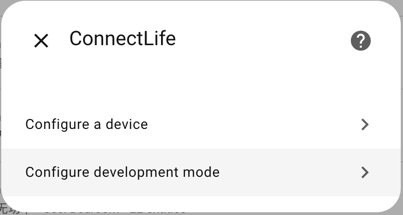
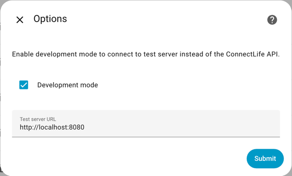

# Developing `connectlife-ha`

## Prerequisites

1. `uv`: https://docs.astral.sh/uv/getting-started/installation/
2. Home Assistant development environment: https://developers.home-assistant.io/docs/development_environment

Install the custom component in your Home Assistant development environment
(assuming your configuration directory is `config`):
```bash
home_assistant_repo=<local home-assistant repo>
connectlife_ha_repo=<local connectlife-ha repo>
cd ${home_assistant_repo}
mkdir -p config/custom_components
cd config/custom_components
ln -s ${connectlife_ha_repo}>/custom_componnents/connectlife .
```

Install dev dependencies (in `connectlife-ha` repo):
```bash
uv sync
```

## Generate `strings.json` and `en.json`

This will add strings for new properties, update `translations/en.json`, and sort all translation files.

```bash
uv run python -m scripts.gen_strings
```

## Providing translations

Translation files are located in `custom_components/connectlife/translations/`.

`strings.json` is the source of truth for English strings. It uses Home Assistant
`[%key:...]` references for common strings (e.g. config flow labels). The file
`translations/en.json` is generated automatically from `strings.json` with
`[%key:...]` references expanded — do not edit it manually.

To add or update a translation:

1. Copy `translations/en.json` to a new language file (e.g. `translations/fr.json`)
   or edit an existing one.
2. Translate the values. Do not translate keys, only values.
3. Sort the translation file:
   ```bash
   uv run python -m scripts.sort_translations
   ```

## Validate mapping files

```bash
uv run python -m scripts.validate_mappings
```

## Type checking

```bash
uv run pyright
```

## Use a test server

Clone https://github.com/oyvindwe/connectlife/

In your local `connectlife` repo:
```bash
python -m connectlife.test_server -d dumps
```

Configure the integration to access the test server:




