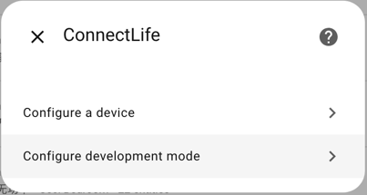
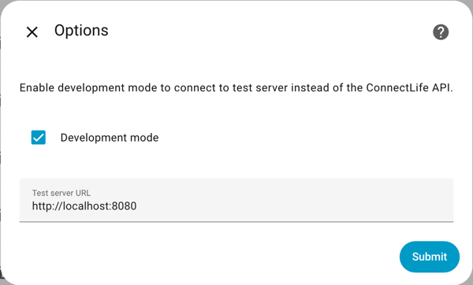

# Developing `connectlife-ha`

## Prerequisites

1. `uv`: https://docs.astral.sh/uv/getting-started/installation/
2. Home Assistant development environment: https://developers.home-assistant.io/docs/development_environment

Install the custom component in your Home Assistant development environment
(assuming your configuration directory is `config`):
```bash
home_assistant_repo=<local home-assistant repo>
connectlife_ha_repo=<local connectlife-ha repo>
cd ${home_assistant_repo}
mkdir -p config/custom_components
cd config/custom_components
ln -s ${connectlife_ha_repo}>/custom_componnents/connectlife .
```

Install dev dependencies (in `connectlife-ha` repo):
```bash
uv sync
```

## Generate `strings.json` and `en.json`

This will add strings for new properties, remove stale keys, update
`translations/en.json`, prune translation files, and sort all translation files.

```bash
uv run python -m scripts.gen_strings
```

To also report missing translation keys after generating:

```bash
uv run python -m scripts.gen_strings --show-missing [lang]
```

## Providing translations

Translation files are located in `custom_components/connectlife/translations/`.

`strings.json` is the source of truth for English strings. It uses Home Assistant
`[%key:...]` references for common strings (e.g. config flow labels). The file
`translations/en.json` is generated automatically from `strings.json` with
`[%key:...]` references expanded — do not edit it manually.

To add or update a translation:

1. Copy `translations/en.json` to a new language file (e.g. `translations/fr.json`)
   or edit an existing one.
2. Translate the values. Do not translate keys, only values.
3. Sort the translation file:
   ```bash
   uv run python -m scripts.sort_translations
   ```

To check which keys are missing from a translation file:

```bash
uv run python -m scripts.check_translations [lang]
```

Omit the language code to check all translation files.

## Validate mapping files

```bash
uv run python -m scripts.validate_mappings
```

## Type checking

```bash
uv run pyright
```

## Use a test server

Clone https://github.com/oyvindwe/connectlife/

In your local `connectlife` repo:
```bash
python -m connectlife.test_server -d dumps
```

Configure the integration to access the test server:





## Testing a pull request

HACS can't install pull request branches, so a pull request has to be installed by hand:

1. Download the PR branch as a zip:
   `https://github.com/oyvindwe/connectlife-ha/archive/refs/heads/<branch>.zip`. The branch name is shown at the top
   of the PR. For a PR from a fork, use the fork's owner and repository instead of `oyvindwe/connectlife-ha`.
2. Replace the `custom_components/connectlife` folder in your Home Assistant config with the one from the zip. Keep a
   copy of the old folder to roll back.
3. Restart Home Assistant.

When reporting back, attach diagnostics for the device (device page → ⋮ → **Download diagnostics**) if something
doesn't work.

To go back, restore the old folder, or reinstall the latest release in HACS, and restart Home Assistant.
